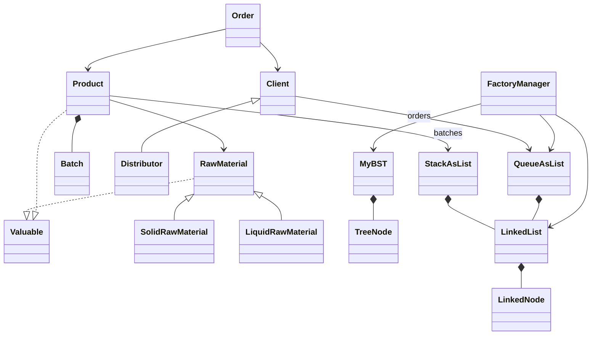

<div align="center">

# 🏭 Sneki

### Food Factory Inventory & Order Management System

</div>

<p align="center">
  
</p>

---

<table>
<tr>

<td width="60%" valign="top">

## 📋 Overview

Sneki is a Java-based system for managing raw materials, products, warehouse inventory, and customer orders in a food manufacturing factory.

The project demonstrates core Object-Oriented Programming principles and data structures through a realistic factory management simulation.

### 🛠 Built With

- Java
- Object-Oriented Programming
- Java Collections Framework

### 📚 Data Structures

- Binary Search Tree (BST) – Client Management
- Queue – Order Processing
- Stack – Batch Inventory Management
- Linked List – Product & Material Storage
- Arrays – Catalog & Raw Material Storage

</td>

<td width="40%" align="center">


</td>

</tr>
</table>

---

## ✨ Features

- 📦 Inventory Management
- 🥫 Raw Material Tracking
- 🛒 Customer main.baseClasses.Order Processing
- 🚚 main.baseClasses.Distributor Management
- 📅 Expiration Date Monitoring
- 💰 Profit & Value Calculations
- 🌳 Binary Search Tree Inventory Storage
- 🔄 Queue-Based main.baseClasses.Order Management

## 📊 UML Diagram



---

## 🏗️ Architecture

```text 
main.baseClasses.Client
 ├── main.baseClasses.Distributor

main.baseClasses.RawMaterial (Abstract)
 ├── main.baseClasses.LiquidRawMaterial
 └── main.baseClasses.SolidRawMaterial

main.baseClasses.Product
 └── main.baseClasses.RawMaterial List

main.baseClasses.Order
 └── main.baseClasses.Product List
```

---

## 🛠️ Built With

- Java
- Object-Oriented Programming
- Java Collections Framework
- Binary Search Trees (BST)
- Queues
- Linked Lists

---

## 📂 Project Structure

```text
```text
src/
├── main/
│   └── Main.java
│
├── main/baseClasses/
│   ├── Product.java
│   ├── Batch.java
│   ├── Order.java
│   ├── Client.java
│   ├── Distributor.java
│   ├── RawMaterial.java
│   ├── SolidRawMaterial.java
│   ├── LiquidRawMaterial.java
│   └── Valuable.java
│
├── dataStructures/
│   ├── LinkedList.java
│   ├── LinkedNode.java
│   ├── QueueAsList.java
│   ├── StackAsList.java
│   ├── MyBST.java
│   └── TreeNode.java
│
└── managers/
    └── FactoryManager.java
```

```

---

## 👥 Contributors

- [Nir Sharabi](https://github.com/NirSharabi)
- [Alon Mishkin](https://github.com/AlonMish67)
- [Noam Abutbul](https://github.com/abnoam)
- [Yosif Stolovitsky](https://github.com/Shmittzy)
---

<div align="center">

Made with ☕ and Java

</div>
